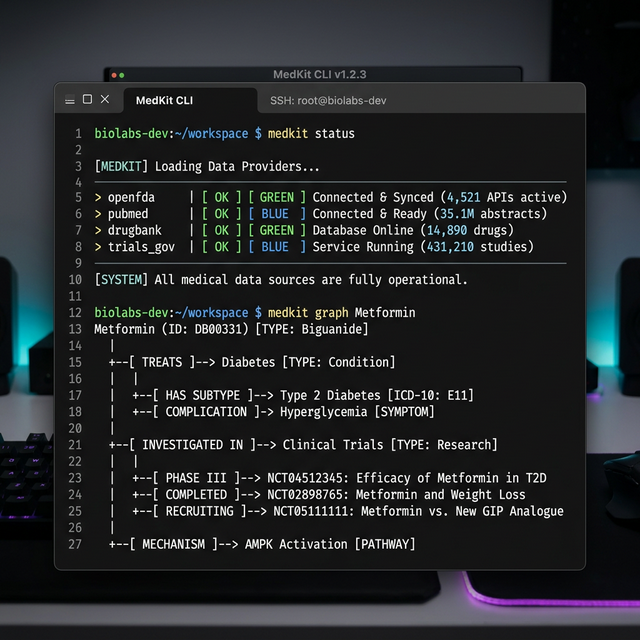

# 🏥 MedKit: A Unified Platform for Medical Data APIs

[](https://github.com/interestng/medkit/actions)
[](https://www.python.org/)
[](https://opensource.org/licenses/MIT)

MedKit is a high-performance, unified SDK that transforms fragmented medical data APIs into a single, programmable platform. It provides a clean interface for **OpenFDA**, **PubMed**, and **ClinicalTrials.gov**, augmented with a clinical intelligence layer and relationship mapping.



## ✨ Quick Example

```python
from medkit import MedKit

with MedKit() as med:
    # Query trials directly in plain English
    results = med.ask("clinical trials for melanoma")
    
    # Real Output Example:
    # Trials:
    # • Phase III Pembrolizumab Trial
    # • Targeted BRAF Therapy Study
    print(results.trials[0].title)
```

---

## 🤔 Why MedKit?

| Feature | Without MedKit | With MedKit |
| :--- | :--- | :--- |
| **Integrations** | 3 separate APIs / SDKs | **One** unified client |
| **Queries** | 3 fragmented formats | **One** schema & ask() engine |
| **Logic** | Manual data correlation | Native **knowledge graphs** |
| **Speed** | Ad-hoc caching | Built-in **Disk/Memory Cache** |

---

## 🏗️ Architecture

MedKit abstracts complexity through a multi-layered provider system:

```text
      Developer / User
             │
             ▼
    ┌───────────────────┐
    │   MedKit Client   │ (Sync / Async)
    └─────────┬─────────┘
              │
    ┌─────────┴─────────────────────┐
    │       Intelligence Layer      │
    │  ├─ Ask Engine (Routing)      │
    │  ├─ Graph Engine (Context)    │
    │  └─ Interaction Engine        │
    └─────────┬─────────────────────┘
              │
    ┌─────────┴─────────────────────┐
    │       Providers Layer         │
    │  ├─ OpenFDA     (Drug Label)  │
    │  ├─ PubMed      (Research)    │
    │  └─ ClinTrials  (Studies)     │
    └───────────────────────────────┘
```

---

## 🚀 Core Platform Features

- **Clinical Interaction Engine**: High-fidelity detection of drug-drug contraindications via `med.interactions()`.
- **Capability-Based Routing**: Intelligent query routing based on provider capabilities.
- **Actionable Research**: Native URL generation for all papers and trials with direct CLI opening (`--open`).
- **Natural Language Engine (`med.ask()`)**: Query medical data in plain English with automated query sanitization.
- **Medical Relationship Graph (`med.graph()`)**: Visualize connections with descriptive, title-based node labeling.
- **Provider Health Dashboard**: Real-time status and latency tracking via `medkit status`.
- **Research Data Export**: Native CSV and JSON export for medical researchers.
- **Async & Sync Support**: High-concurrency support with `AsyncMedKit`.

---

## 📂 Data Providers

MedKit currently integrates the following foundational medical databases:

- **OpenFDA**: Official drug labels, safety information, and manufacturing data from the U.S. Food and Drug Administration.
- **PubMed**: The world's largest biomedical research database, providing access to over 35 million citations.
- **ClinicalTrials.gov**: A comprehensive database of privately and publicly funded clinical studies conducted around the world.

---

## 📦 Installation

```bash
pip install medkit-sdk
```

---

## 📖 Quick Start

### 1. Check Drug Interactions
```python
from medkit import MedKit

with MedKit() as med:
    # Check for potential risks
    risks = med.interactions(["aspirin", "warfarin"])
    for risk in risks:
        print(f"Risk: {risk['warning'].risk} (Severity: {risk['warning'].severity})")
```

### 2. High-Concurrency Search (Async)
```python
from medkit import AsyncMedKit
import asyncio

async def main():
    async with AsyncMedKit() as med:
        results = await med.papers("CRISPR gene editing")
        print(f"Found {len(results)} recent papers.")

asyncio.run(main())
```

### 3. Medical Relationship Graph
MedKit's signature feature: a medical knowledge graph. Map how drugs relate to trials and papers.
```python
graph = med.graph("metformin")
```

**Example Output:**
```text
Metformin
 ├─ treats → Type 2 Diabetes
 ├─ trial → Phase III Study (NCT012345)
 └─ research → Meta-analysis 2026
```

### 4. Extending Providers (Plugins)
MedKit is built on a plugin architecture. You can easily add custom data sources.
```python
from medkit.providers.base import BaseProvider

class MyPrivateDB(BaseProvider):
    name = "privatedb"
    
    def search_sync(self, query: str):
        return {"data": "..."}

with MedKit() as med:
    med.register_provider(MyPrivateDB())
```

---

## 🖥️ CLI Power Tools

### Provider Status
Check the real-time health and latency of all integrated medical APIs.
```bash
$ medkit status

  MedKit Provider Health  
+-----------------------------------+
| Provider       | Status | Latency |
|----------------+--------+---------|
| openfda        | ONLINE |   120ms |
| pubmed         | ONLINE |   210ms |
| clinicaltrials | ONLINE |   180ms |
+-----------------------------------+
```

### Direct Research Access
Display clickable URLs or open the top result directly in your browser.
```bash
$ medkit papers "Alzheimer's" --limit 3 --links --open
```

### Clinical Ask
```bash
$ medkit ask "is metformin safe with alcohol?"
```

---

## 🤝 Contributing

Pull requests are welcome. For major changes, please open an issue first to discuss what you would like to change.

### Development Setup
1. Clone the repository.
2. Install dependencies: `pip install -e .`
3. Run tests:
```bash
pytest
```

---

## 🗺️ Roadmap

- **Phase 2.0**: AI-powered research summaries and evidence strength scoring.
- **Phase 2.1**: Advanced pharmacogenomics provider integration.
- **Phase 3.0**: Local GraphQL API to serve the unified medical mesh.

---

## 📄 License
This project is licensed under the MIT License - see the [LICENSE](LICENSE) file for details.
